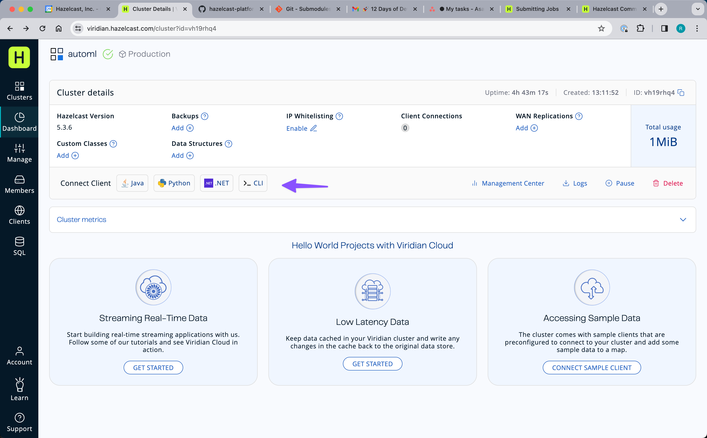
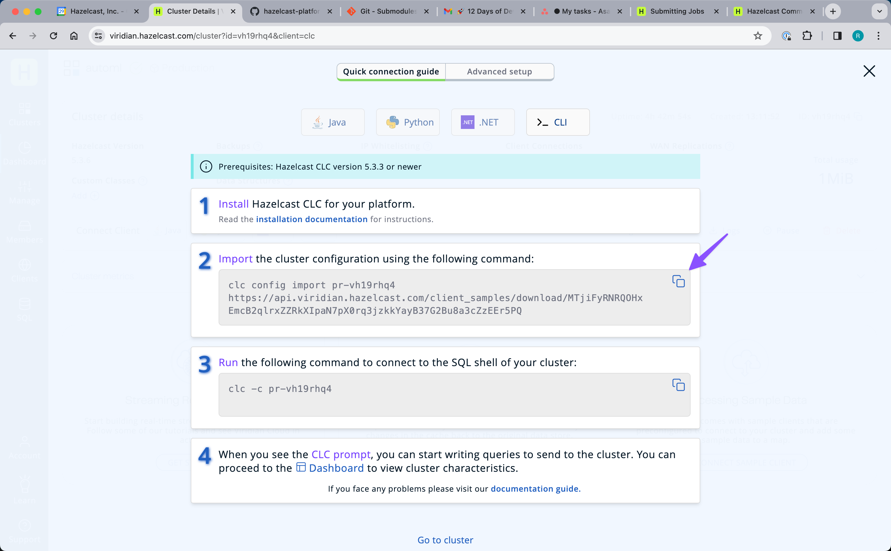

# Overview

This project contains utility code to simplify connecting to Viridian. To use this library, you will need to download and build the project 
in your local environment.  It is not published to an external maven 
repository.

```sh
# in the viridian-util directory, run the following
mvn clean install
```

You can reference the dependency in your other projects as show below.
```xml
<dependency>
    <groupId>hazelcast.platform.solutions</groupId>
    <artifactId>viridan-util</artifactId>
    <version>0.1.3</version>
</dependency>
```

# Connecting to Viridian 

Connecting to Viridian requires the `hazelcast-enterprise` dependency 
because Viridian connections use TLS.  In order to connect, you need 
a keystore file, a truststore file , the cluster id, a "discovery token" and a password to the trustore and keystore files.  2 approaches to obtaining and documenting this information are show below.

## Option 1 - Using Configuration Imported With CLC

### Obtaining the Connection Information

If you have CLC ( see https://docs.hazelcast.com/clc/latest/overview) installed on the machine where the client will run, CLC can download 
all of the required configuration for you.  See the screenshots
below.

__Step 1__



__Step 2__



All of the required information will be downloaded to you CLC home
directory. For the next step, you will need to know the name of your 
cluster.  In the example above, it is `pr-vh19rhq4`.  If you are 
not sure, you can list all of your imported configuration with 
`clc config list`.

### Configuring the Environment

Set your VIRIDIAN_SECRETS_DIR environment variable as shown below.
__Be sure to change `mycluster` to the name of your cluster.__

```
export VIRIDIAN_SECRETS_DIR=`clc home`/configs/mycluster
```

This library will extract all of the needed configuration and 
key material from the `VIRIDIAN_SECRETS_DIR` directory.


## Option 2 - Using Manually Obtained Configuration

This utility requires connection information for your Viridian cluster. 
The information can be supplied with environment variables using `ViridianConnection.configureFromEnvironment` or by directly supplying 
the connection information to `ViridianConnection.configure`.  

### Obtaining the Connection Information

This library, and its Python companion library use the artifacts 
obtained from the Viridian advanced configuration page.  You will need to 
download and unzip the keystore file and you will also need the 
cluster id, discovery token and key store password.  These are all 
available on the advanced connection page. See below.


### Configuring the Environment Variables

The following 4 environment variables need to be set.  One environment 
variable corresponds to each value on the advanced connection page.
```
VIRIDIAN_SECRETS_DIR       path to the unzipped keystore
VIRIDIAN_CLUSTER_ID        cluster id 
VIRIDIAN_PASSWORD          keystore password
VIRIDIAN_DISCOVERY_TOKEN   discovery token
```

## Usage Example

Regardless of the which option you use, you can connect to a Viridian
cluster using code like that shown below.

```java
...
ClientConfig clientConfig = new ClientConfig();
if (ViridianConnection.viridianConfigPresent()){
    ViridianConnection.configureFromEnvironment(clientConfig);
} else {
    clientConfig.setClusterName(hzClusterName);
    clientConfig.getNetworkConfig().addAddress(hzServers);
}

HazelcastInstance hzClient = HazelcastClient.newHazelcastClient(clientConfig);
...
```

> NOTE:
The `ViridianConnection.configureFromEnvironment` method actually 
modifies the `ClientConfig` instance that is passed to it.  You 
can make additional modifications to the configuration before using it.
