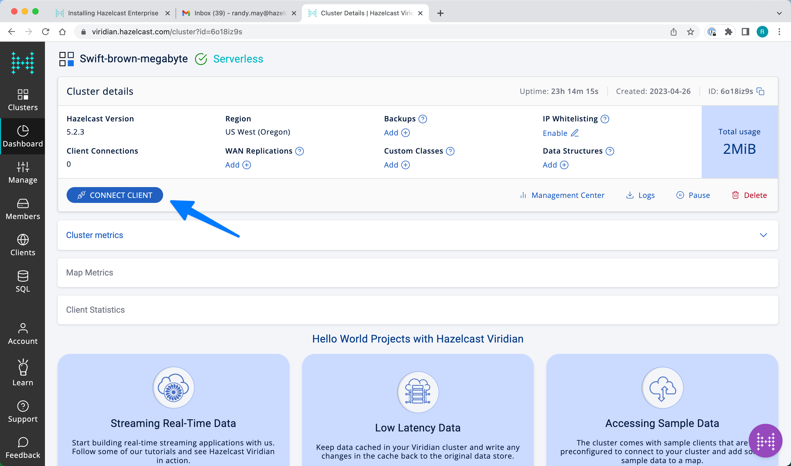
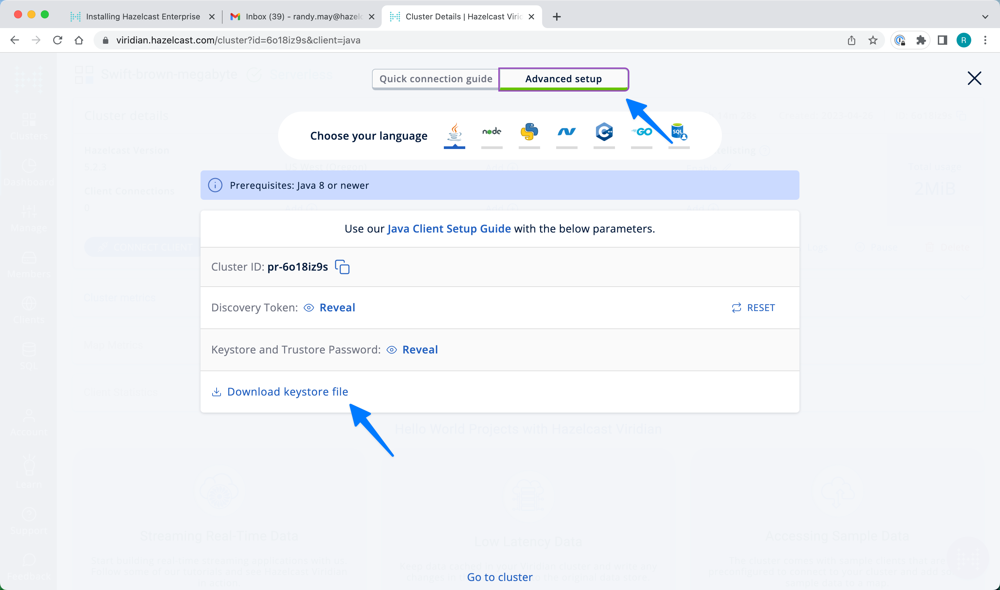

# Overview

This project contains utility code to simplify connecting to Viridian. To use this library, you will need to download and build the project 
in your local environment.  It is not published to an external maven 
repository.

```sh
# in the viridian-util directory, run the following
mvn clean install
```

You can reference the dependency in your other projects as show below.
```xml
<dependency>
    <groupId>hazelcast.platform.solutions</groupId>
    <artifactId>viridan-util</artifactId>
    <version>0.1.1</version>
</dependency>
```

# Connecting to Viridian 

This utility requires connection information for your Viridian cluster. 
The information can be supplied with environment variables using `ViridianConnection.configureFromEnvironment` or by directly supplying 
the connection information to `ViridianConnection.configure`.  

## Obtaining the Connection Information

This library, and its Python companion library use the artifacts 
obtained from the Viridian advanced configuration page.  You will need to 
download and unzip the keystore file and you will also need the 
cluster id, discovery token and key store password.  These are all 
available on the advanced connection page. See below.





## Configuring the Environment Variables

The following 4 environment variables need to be set.  One environment 
variable corresponds to each value on the advanced connection page.
```
VIRIDIAN_SECRETS_DIR       path to the unzipped keystore
VIRIDIAN_CLUSTER_ID        cluster id 
VIRIDIAN_PASSWORD          keystore password
VIRIDIAN_DISCOVERY_TOKEN   discovery token
```

## Usage Example

```java
...
ClientConfig clientConfig = new ClientConfig();
if (ViridianConnection.viridianConfigPresent()){
    ViridianConnection.configureFromEnvironment(clientConfig);
} else {
    clientConfig.setClusterName(hzClusterName);
    clientConfig.getNetworkConfig().addAddress(hzServers);
}

HazelcastInstance hzClient = HazelcastClient.newHazelcastClient(clientConfig);
...
```

The `ViridianConnection.configureFromEnvironment` method actually 
modifies the `ClientConfig` instance that is passed to it.  You 
can make additional modifications to the configuration before using it.
